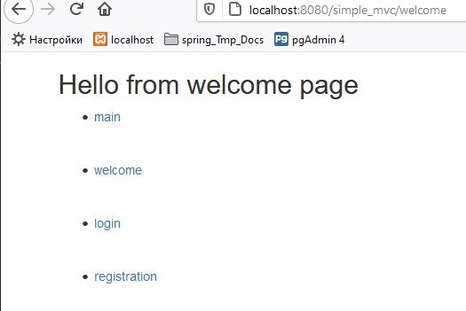
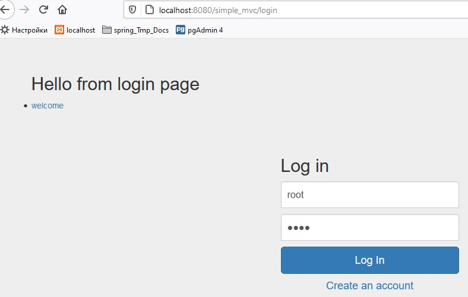
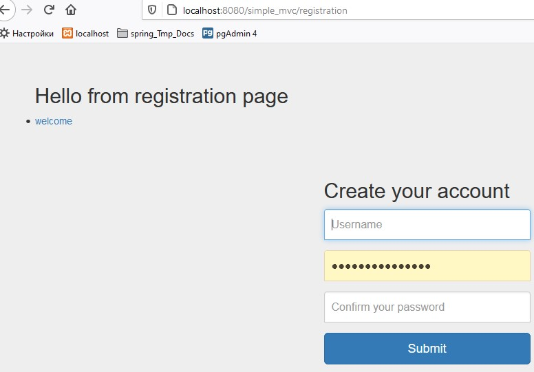
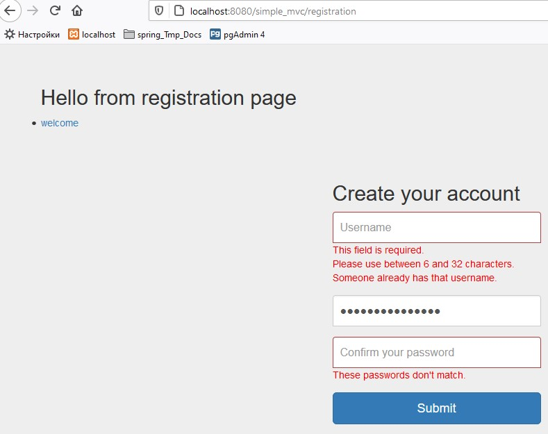

# Spring MVC + Spring Security Xml Config with User Repository
​	

##### 			https://hellokoding.com/registration-and-login-example-with-spring-xml-configuration-maven-jsp-and-mysql/

Use BCryptPasswordEncoder for Spring Security

..

..

..

..

