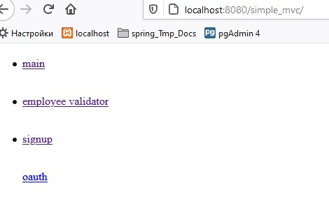
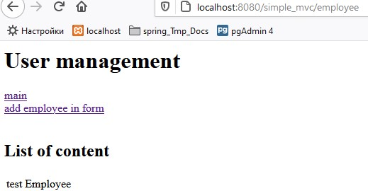
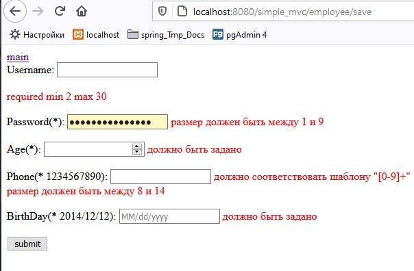
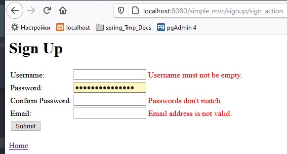
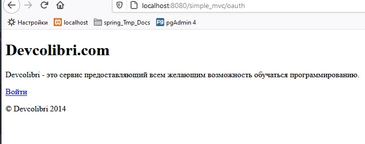
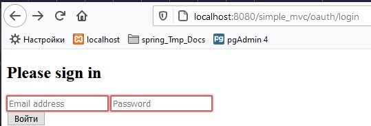

# from devcases.com h2 data base embedded
# and from:..
#####

mix Examples

##### https://devcases.com/java/spring-3-mvc-hibernate-h2-embedded-database-tutorial/

- ##### https://devcases.com/wp-content/uploads/2019/03/userManager.zip

##### https://www.javatpoint.com/spring-mvc-validation
##### https://habr.com/ru/post/424819/
##### https://www.journaldev.com/2668/spring-validation-example-mvc-validator
##### https://www.baeldung.com/spring-mvc-custom-validator
##### http://www.seostella.com/ru/article/2012/06/20/formy-i-validaciya-form-v-spring.html
##### https://alexkosarev.name/2018/07/30/bean-validation-api/

..

..

..

..

..
