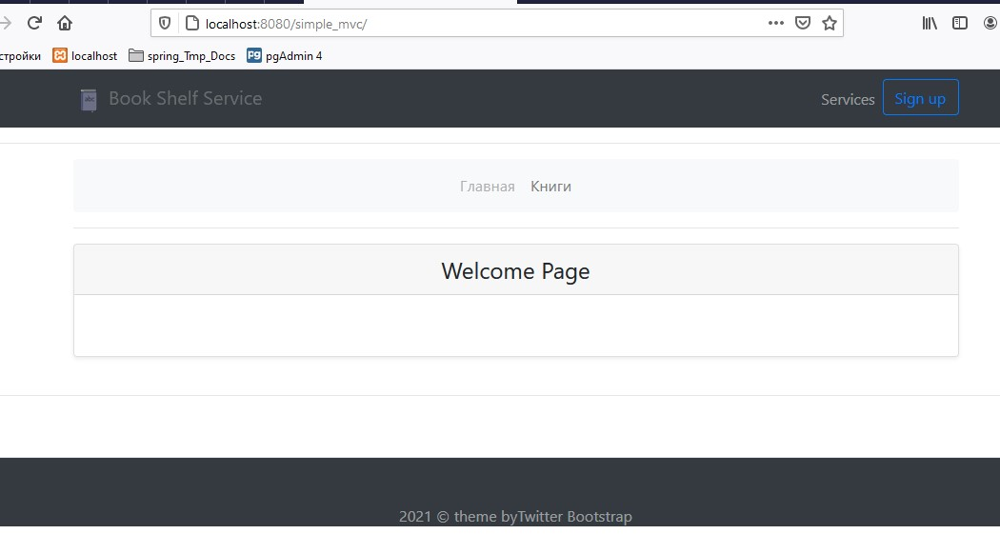
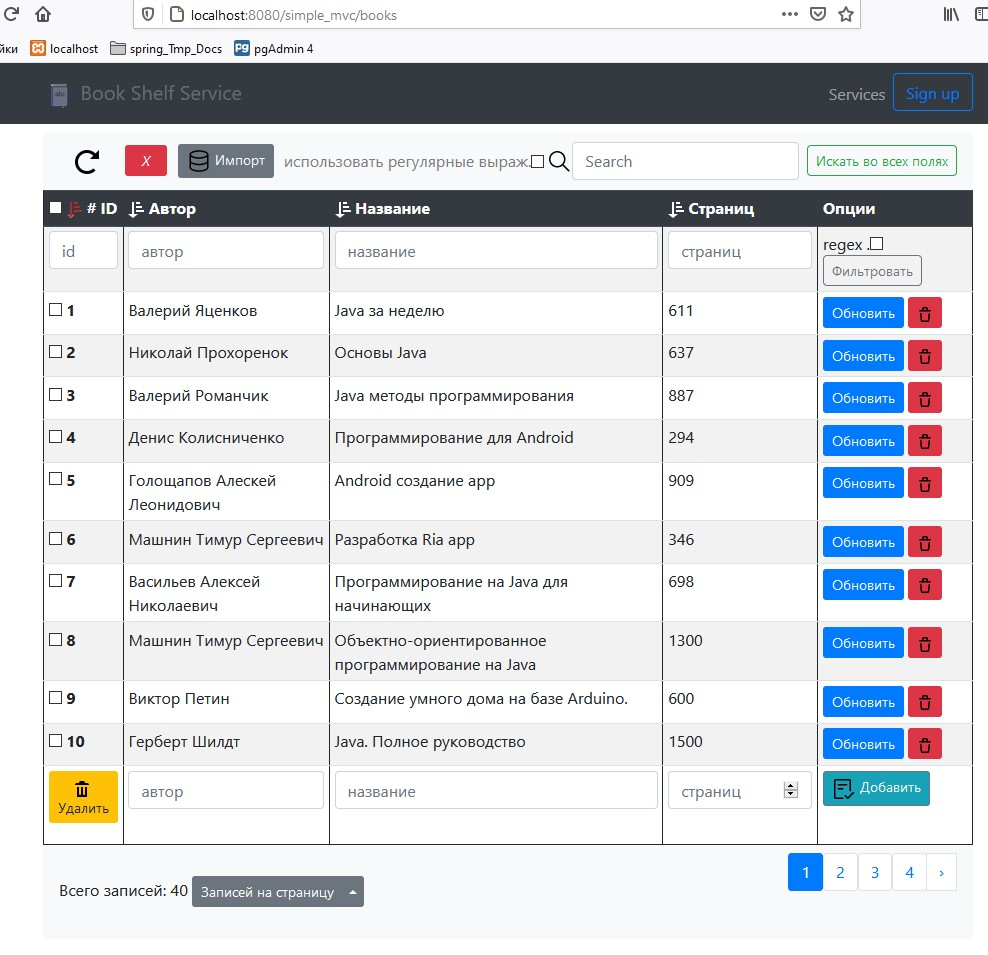
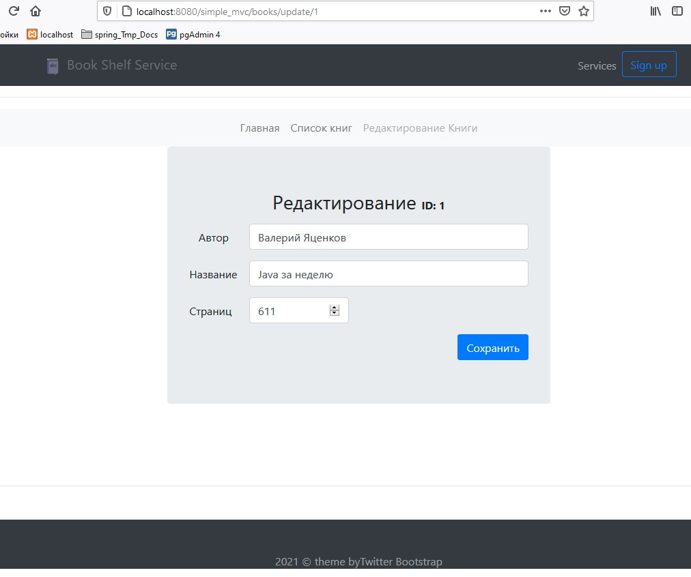

# Before use the above whatever, have to think about how it works.

# devcases.com h2 data base embedded
##### 				

##### https://devcases.com/java/spring-3-mvc-hibernate-h2-embedded-database-tutorial/

- ##### https://devcases.com/wp-content/uploads/2019/03/userManager.zip

### and...
### and...
### and...
# springboot-thymeleaf-crud-pagination-sorting-webapp

Spring Boot CRUD Web application with Pagination and Sorting features using Spring Boot, ThymeLeaf, Spring Data JPA, Hibernate, MySQL database

### Tutorial - Spring Boot CRUD Web Application with Thymeleaf, Spring MVC, Spring Data JPA, Hibernate, MySQL
https://www.javaguides.net/2020/05/spring-boot-crud-web-application-with-thymeleaf.html

### YouTube Video - Spring Boot CRUD Web Application with Thymeleaf, Spring MVC, Spring Data JPA, Hibernate, MySQL
https://youtu.be/_5sAmaRJd2c

### Tutorial - Pagination and Sorting with Spring Boot, ThymeLeaf, Spring Data JPA, Hibernate, MySQL
https://www.javaguides.net/2020/06/pagination-and-sorting-with-spring-boot-thymeleaf-spring-data-jpa-hibernate-mysql.html

### YouTube Video  - Pagination and Sorting with Spring Boot, ThymeLeaf, Spring Data JPA, Hibernate, MySQL
=> https://youtu.be/Aie8n12EFQc

..

..
